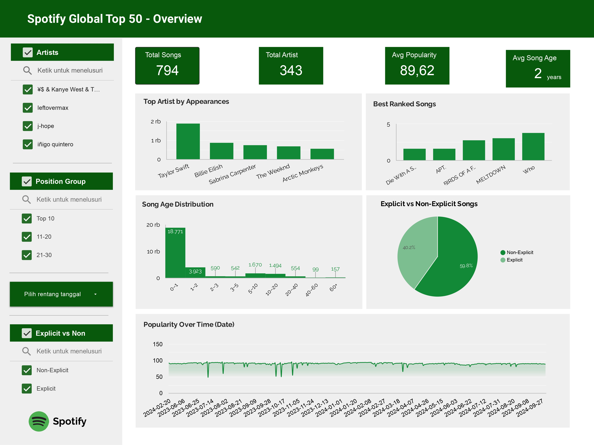
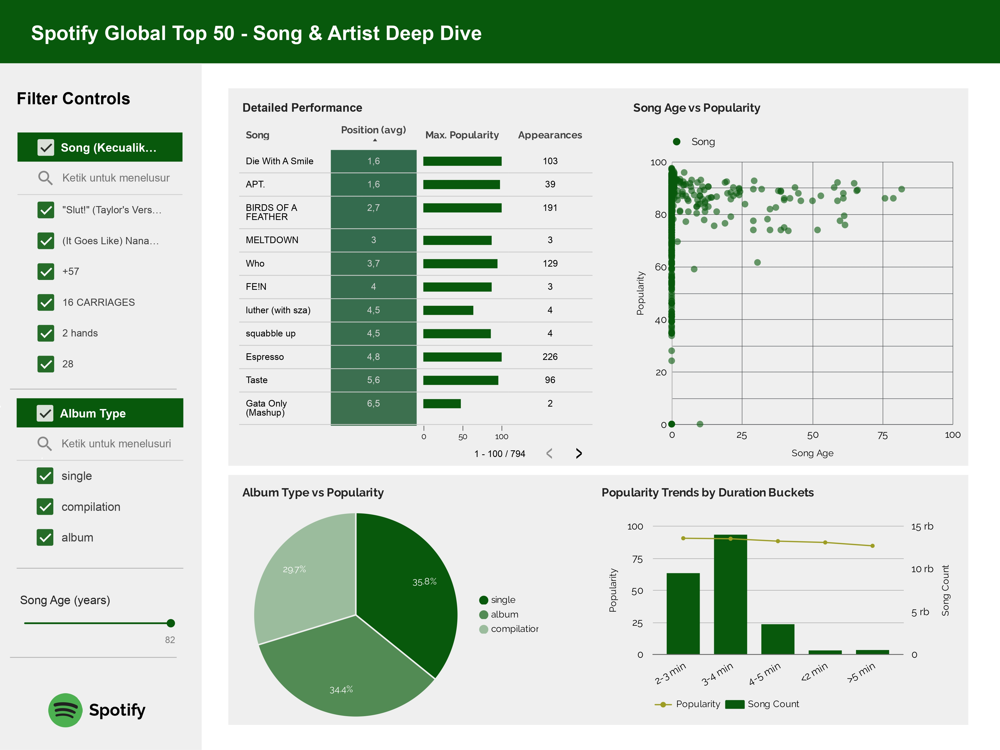

# 🎵 Spotify Global Top 50 Dashboard

## 📌 Project Overview
This project analyzes **Spotify Global Top 50** data to explore song performance, popularity trends, and song lifecycle characteristics.  
The results are presented through an **interactive dashboard** consisting of two pages: *Overview* and *Song & Artist Deep Dive*.

---

## 🎯 Objectives
- Analyze the relationship between **song age and popularity**
- Identify **top-performing songs and artists**
- Understand **song age distribution** in the Global Top 50 chart
- Explore popularity trends over time
- Build a concise yet insightful analytical dashboard

---

## 📂 Dataset
**Source:** Kaggle – Spotify Global Top 50  
**Format:** CSV  

🔗 Dataset link: *[Spotify Top 50 Playlist Songs](https://www.kaggle.com/datasets/anxods/spotify-top-50-playlist-songs-anxods)*

---

## 🔍 Exploratory Data Analysis (EDA)

During the Exploratory Data Analysis (EDA) phase, the dataset structure and data quality were examined.  
The dataset consists of **27,800 rows** with **11 columns**, and no missing values were found during the initial exploration.

The dataset contains the following columns:

- `date` — Date when the song appeared in the Spotify Global Top 50 chart  
- `position` — Song ranking position (1–50)  
- `song` — Song title  
- `artist` — Artist name  
- `popularity` — Spotify popularity score  
- `duration_ms` — Song duration in milliseconds  
- `is_explicit` — Explicit content indicator  
- `album_type` — Album type (Single / Album / Compilation)  
- `total_tracks` — Total number of tracks in the album where the song was released  
- `release_date` — Song release date (formats: YYYY-MM-DD, YYYY-MM, YYYY)  
- `album_cover_url` — URL of the album cover image  

---

## 🧹 Data Cleansing

Several data cleansing steps were performed to ensure data consistency and quality, including:

- Converting columns to appropriate data types
- Standardizing date formats
- Removing irrelevant columns for analytical purposes
- Checking and correcting potential typos or inconsistent text values
- Trimming unnecessary whitespace

These steps ensured that the dataset was ready for aggregation and visualization.

---

## ⚙️ Feature Engineering & Further Processing

To support deeper analysis and dashboard creation, additional features were engineered.  
One of the key derived features is **`song_age`**, which represents the age of a song at the time it appeared on the chart.

Song age was calculated as the difference between the chart date (`date`) and the song release date (`release_date`).  
Due to inconsistent `release_date` formats, different approaches were applied to prevent **NaT (Not a Time)** values:

- **YYYY-MM-DD format**  
  The release date was converted to `datetime` and directly subtracted from the chart date.

- **YYYY-MM format**  
  The chart date was converted to a monthly period (`.to_period('M')`) to align formats before subtraction.

- **YYYY format**  
  Song age was calculated using the difference between the release year and the chart year.

The resulting song age values were then converted into **years** to improve interpretability and facilitate dashboard analysis.

---

## 📊 Dashboard Structure
🔗 Dashboard link: *[Spotify Top 50 Global Playlist Songs](https://lookerstudio.google.com/reporting/333fe4c6-c555-4520-8171-83d16ddd8a89)*

### Page 1 Overview
Provides a high-level summary of the Spotify Global Top 50 chart.

**Visualizations include:**
- Total Songs
- Total Artists
- Average Popularity
- Average Song Age
- Top Artists by Appearances
- Best Ranked Songs
- Song Age Distribution
- Explicit vs Non-Explicit Songs
- Popularity Over Time

---

### Page 2 Song & Artist Deep Dive
Focuses on detailed song- and artist-level analysis.

**Visualizations include:**
- Detailed Performance Table
- Scatter Plot: Song Age vs Popularity
- Album Type vs Popularity
- Popularity Trends by Duration Buckets

---

## 🔍 Key Insights
- Newer songs tend to achieve higher popularity, although some older songs maintain strong popularity levels
- Non-explicit songs dominate the Global Top 50 chart
- Songs with durations between 2–4 minutes show the highest average popularity
- Popular artists appear multiple times, indicating consistency in chart performance

---

## 🛠 Tools & Technologies
- **Python:** Pandas, NumPy, Datetime
- **Visualization:** Looker Studio
- **IDE:** VS Code
